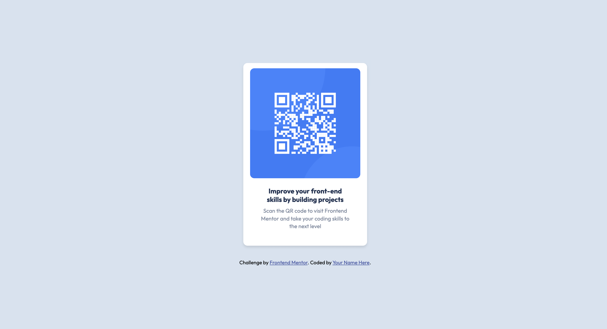

# Frontend Mentor - QR code component solution

This is a solution to the [QR code component challenge on Frontend Mentor](https://www.frontendmentor.io/challenges/qr-code-component-iux_sIO_H). Frontend Mentor challenges help you improve your coding skills by building realistic projects.

## Table of contents

- [Overview](#overview)
  - [Screenshot](#screenshot)
  - [Links](#links)
- [My process](#my-process)
  - [Built with](#built-with)
  - [What I learned](#what-i-learned)
  - [Continued development](#continued-development)
  - [Useful resources](#useful-resources)
- [Author](#author)
- [Acknowledgments](#acknowledgments)

## Overview

### Screenshot

### Links

- [Live Site URL](https://guozonglei.github.io/qr-code-component/)

## My process

### Built with

- HTML5: The <!DOCTYPE html> declaration indicates that this document utilizes HTML5.

- Responsive Design: The tag <meta name="viewport" content="width=device-width, initial-scale=1.0" /> suggests that the page is designed with both mobile and desktop compatibility in mind.

- External Fonts: Through Google Fonts (<link href="https://fonts.googleapis.com/css2?family=Outfit:wght@400;700&display=swap" rel="stylesheet"/>), the web page employs the "Outfit" font.

- External CSS: The use of <link rel="stylesheet" href="styles.css" /> indicates that the CSS is separated into an external file.

- Images & Icons: The  tag is used to display the QR code, and the <link rel="icon" is used to set the website's favicon.

### What I learned

CSS Layout: Flexbox (display: flex) is used for center-aligning elements.

Color Management: The HSL color mode (e.g., hsl(212, 45%, 89%)) provides an intuitive way to adjust colors, where H stands for hue, S stands for saturation, and L stands for lightness.

Font Management: With Google Fonts, it's easy to access and employ a variety of fonts. Here, the "Outfit" font is used with multiple font weights.

Element Styling: Properties like border-radius (for rounded corners) and box-shadow (for shadow effects) are employed to enhance the aesthetic appearance of the webpage.

Responsive Font Sizes: Different font-size values in the CSS ensure that text appears appropriately sized across devices.

### Continued development

After continuous learning, I've found that to account for responsiveness across different devices or screen sizes, one can use media queries (@media queries) to further optimize CSS. This is an area I plan to focus on in the future

### Useful resources

- [MDN Media Queries](https://developer.mozilla.org/en-US/docs/Web/CSS/CSS_media_queries/Using_media_queries) - Description: This is an official documentation from Mozilla, offering a comprehensive explanation on how to use media queries. MDN is one of the primary reference sources for front-end developers, with its content being both detailed and easy to understand.

- [CSS-Tricks A Complete Guide to Responsive Web Design](https://css-tricks.com/snippets/css/a-guide-to-flexbox/) - Description: The CSS-Tricks website provides a plethora of tutorials and tips. This particular guide is dedicated to the fundamentals and best practices of responsive design.

- [Flexbox Froggy](https://flexboxfroggy.com/) - Description: This is an interactive game designed to help you learn and solidify your knowledge of Flexbox. By solving challenges in the game, you'll gain a deeper understanding of how Flexbox works.

## Author

- Website - [Guozonglei](https://www.your-site.com)
- Frontend Mentor - [Guozonglei](https://www.frontendmentor.io/profile/Guozonglei)
- Twitter - [@yourusername](https://www.twitter.com/guozonglei)
